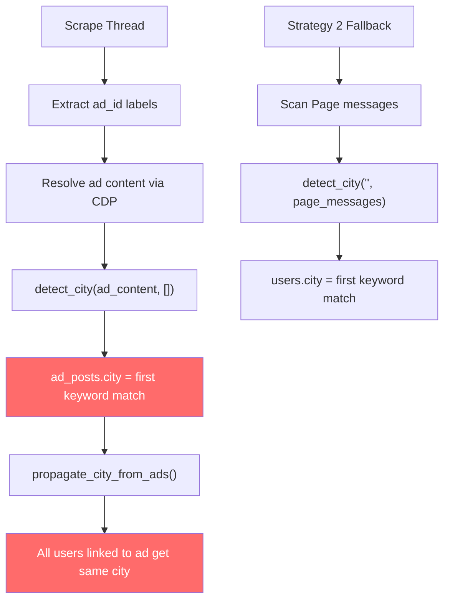

# Spike: City Detection for Individual Seekers

> **ID**: `doc:spike-city-detect-001`
> **Date**: 2026-03-21
> **Status**: Research Complete — Ready for Review
> **Goal**: Redesign how city is assigned to each individual seeker who contacts the Facebook page, replacing the current ad-level keyword-matching approach with per-user, context-aware detection.

---

## 1. Problem Statement

The current city detection system assigns **wrong cities** to seekers. In the latest scrape (92 users), at least **5 users** were classified as "TP. Hồ Chí Minh" when their conversation clearly mentions **Đà Nẵng**.

### Root Cause Example

**Seeker 1233 (Rubi Tím)** — messages say:
> "Địa điểm: Số 2 Xô Viết Nghệ Tĩnh, **Đà Nẵng**"

But `users.city = "TP. Hồ Chí Minh"` because:

1. The street name "Xô Viết Nghệ Tĩnh" is in the `CITY_KEYWORDS["TP. Hồ Chí Minh"]` list
2. `detect_city()` iterates HCM **before** Đà Nẵng → first match wins
3. The ad `6908777851414` was resolved as HCM
4. `propagate_city_from_ads()` copied HCM to **all 26 users** linked to that ad

### Current City Distribution

| City | Count | % |
|---|---|---|
| Unknown | 34 | 37% |
| Hà Nội | 22 | 24% |
| TP. Hồ Chí Minh | 19 | 21% |
| Online | 14 | 15% |
| Đà Nẵng | 3 | 3% |

---

## 2. Current System (As-Is)

### Architecture

```
Ad Context Text → detect_city() → ad_posts.city
                                      ↓
                          propagate_city_from_ads()
                                      ↓
                                users.city (batch)
```

### Code Flow



### 3 Critical Bugs

| Bug | Impact | Example |
|---|---|---|
| **Ambiguous keywords** | Street names exist in multiple cities | "Xô Viết Nghệ Tĩnh" → HCM, but address says Đà Nẵng |
| **First-match wins** | Dict iteration order determines city | HCM checked before Đà Nẵng → HCM always wins |
| **Ad-level propagation** | One ad's city → all linked users | Ad resolved from `Thủy Tiên`'s ĐN thread → 26 users get HCM |

---

## 3. Proposed Design (To-Be)

### Design Principle

> **City must be detected PER USER, not per ad.**
> Each seeker's city should come from **their own conversation context**, not from a shared ad record.

### 3.1 Multi-Signal Scoring Architecture

Replace the first-match approach with a **weighted scoring system** that considers multiple signals:

```
Per-User City Detection Pipeline
═════════════════════════════════

Signal 1: Customer's own messages     (weight: 3)
    ↓
Signal 2: Page replies to THIS user   (weight: 2)
    ↓
Signal 3: Ad context content          (weight: 1, fallback only)
    ↓
Score all cities → Pick highest score
```

### 3.2 Signal Priority (Highest → Lowest)

| Priority | Signal | Weight | Rationale |
|---|---|---|---|
| **1** | Customer messages | × 3 | Seeker says "Mình ở Đà Nẵng" → strongest signal |
| **2** | Page replies to this user | × 2 | Page sends class address to THIS user specifically |
| **3** | Ad content (shared) | × 1 | Weakest — same ad serves multiple cities |

### 3.3 Context-Aware Keyword Matching

Instead of checking keywords in isolation, check for **nearby city names** that override ambiguous keywords:

```python
# CURRENT (broken)
for city, keywords in CITY_KEYWORDS.items():
    if keyword in text:
        return city  # First match wins — WRONG

# PROPOSED
def detect_city_scored(text: str) -> dict[str, int]:
    """Return {city: score} for ALL matching cities."""
    scores = {}
    for city, keywords in CITY_KEYWORDS.items():
        for kw in keywords:
            if kw in text:
                scores[city] = scores.get(city, 0) + 1
    return scores
```

### 3.4 Disambiguation Rule

When an ambiguous keyword (e.g., "Xô Viết Nghệ Tĩnh") causes multiple cities to match, apply a **proximity rule**: if a city name appears within 100 characters of the keyword, that city wins.

```python
# "Số 2 Xô Viết Nghệ Tĩnh, Đà Nẵng"
#   ↑ "Xô Viết Nghệ Tĩnh" matches HCM keyword
#   ↑ But "Đà Nẵng" appears 2 chars later → Đà Nẵng wins
```

### 3.5 Remove Ad-Level Propagation

Replace `propagate_city_from_ads()` (batch: ad → all users) with per-user detection:

```
CURRENT:  ad_posts.city → propagate → all users linked to ad
PROPOSED: each user's own messages → detect_city_per_user() → users.city
```

### 3.6 Proposed Algorithm

```python
def detect_city_for_user(thread_id: str, conn) -> str:
    """Detect city for ONE user from their own conversation."""
    
    # Signal 1: Customer messages (weight 3)
    customer_msgs = get_messages(thread_id, sender="Customer")
    customer_scores = detect_city_scored(join(customer_msgs))
    
    # Signal 2: Page replies (weight 2)  
    page_msgs = get_messages(thread_id, sender="Page")
    page_scores = detect_city_scored(join(page_msgs))
    
    # Signal 3: Ad content (weight 1, fallback)
    ad_content = get_ad_content_for_user(thread_id)
    ad_scores = detect_city_scored(ad_content)
    
    # Weighted merge
    final_scores = {}
    for city in set(list(customer_scores) + list(page_scores) + list(ad_scores)):
        final_scores[city] = (
            customer_scores.get(city, 0) * 3 +
            page_scores.get(city, 0) * 2 +
            ad_scores.get(city, 0) * 1
        )
    
    # Disambiguation: if ambiguous keyword, check proximity
    final_scores = apply_disambiguation(text, final_scores)
    
    if not final_scores:
        return "Unknown"
    return max(final_scores, key=final_scores.get)
```

---

## 4. Ambiguous Keywords to Fix

These keywords exist in multiple cities and cause false matches:

| Keyword | Currently In | Also Exists In | Action |
|---|---|---|---|
| `Xô Viết Nghệ Tĩnh` | HCM | Đà Nẵng | **Remove** — use proximity rule instead |
| `Bình Thạnh` | HCM | (unique) | Keep |
| `Vinh` | Nghệ An | Common Vietnamese name | Add word-boundary check |

### Recommended `CITY_KEYWORDS` Cleanup

```diff
 "TP. Hồ Chí Minh": ["Hồ Chí Minh", "TP.HCM", "TPHCM", "Sài Gòn", "Saigon",
-                     "Xô Viết Nghệ Tĩnh", "Bình Thạnh", "Quận 1", "Quận 3",
+                     "Bình Thạnh", "Quận 1", "Quận 3",
                      "Quận 7", "Thủ Đức", "Gò Vấp", "Tân Bình", "HCM"],
```

---

## 5. Implementation Strategy

### Phase 1: Quick Fix (Immediate)
- Remove ambiguous keywords from `CITY_KEYWORDS`
- No architecture change, just keyword cleanup

### Phase 2: Per-User Detection (Short-term)
- Implement `detect_city_for_user()` that scores per-user messages
- Replace `propagate_city_from_ads()` with per-user batch detection
- Add `tools/classify_city.py` to retroactively fix the existing database
- Write unit tests for proximity matches and edge cases like "Online"

### Phase 3: Proximity Disambiguation (Medium-term)
- Add proximity rule for remaining ambiguous keywords
- Consider regex word-boundary matching for short keywords like "Vinh"

### Phase 4: LLM-Based Detection (Future, via ADK)
- Analyzer agent already outputs `interaction_summary` including city context
- City detection becomes a natural output of the LLM's conversation analysis
- No keyword dictionary needed — LLM understands context natively

---

## 6. Verification Plan

### Automated Tests
```bash
# Test per-user detection with known cases
python -m pytest tests/test_city_detection.py -v
```

### Manual Verification
```bash
# Run per-user detection, compare old vs new
python tools/fetch_fb_messages.py --action detect_city_per_user --pageId 1548373332058326

# Check known false positives
python -c "
SELECT u.thread_name, u.city, m.content
FROM users u JOIN messages m ON m.thread_id = u.thread_id
WHERE m.content LIKE '%Đà Nẵng%' AND u.city != 'Đà Nẵng'
"
```

### Success Criteria
- Zero users with "Đà Nẵng" in messages classified as HCM
- City detection accuracy > 90% (manually verified on 20 samples)
- "Unknown" count reduced from 37% to < 25%

---

## 7. Summary

| Aspect | Current | Proposed |
|---|---|---|
| **Granularity** | Per-AD (shared) | Per-USER (individual) |
| **Algorithm** | First keyword match | Weighted multi-signal scoring |
| **Ambiguity** | Not handled | Proximity disambiguation |
| **Signals** | Ad content only | Customer msgs + Page replies + Ad content |
| **Propagation** | `ad → all linked users` | Each user independently |
| **Future** | Keyword dict | LLM-based (via ADK Analyzer) |

---

## 8. Outcome (March 2026)

Instead of building a complex keyword proximity engine, we successfully pivoted to using an **LLM-driven classifier** (`fb_pipeline/contracts/l1_city_llm.py`), orchestrated by `detect_city_smart`. 
It evaluates the same 3 signals (Customer Messages, Page Replies, Ad Context) but leverages AI to understand intent, falling back to the legacy keyword scanner only if the LLM is unavailable or fails. This greatly improved classification accuracy by solving edge cases where multiple cities are mentioned or implied without relying on brittle proximity heuristics.
